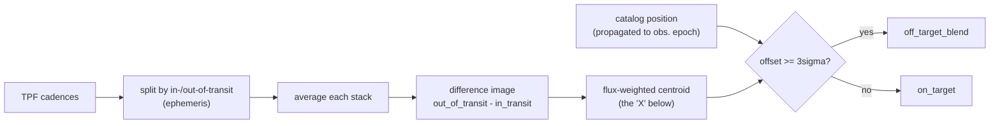
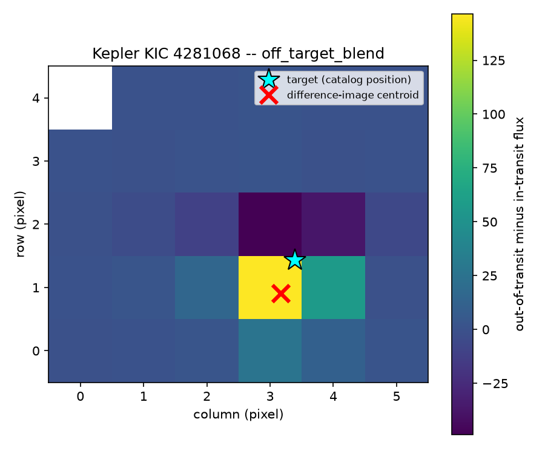

# localizr

Pixel-level transit localization for TESS and Kepler: given a target and a
transit ephemeris, `localizr` answers **"is this signal actually coming from
the target star, or from a blended neighbor?"**

It does this the same way the Kepler DR25 pipeline's own centroid-offset
vetting flag (`koi_fpflag_co`) does: by looking at where the light is
actually moving on the detector during transit, not just at the light curve.

> [!IMPORTANT]
> This tool needs **network access** (MAST + Gaia) and a **real target
> pixel file (TPF)**. It cannot run on light-curve-only inputs (e.g. a
> `.csv` of flux vs. time) — there's no pixel data left to localize against.

## The technique

A transit dims *some* pixel on the detector. If it dims the target's own
pixel, the transit is real and on-target. If it actually dims a different,
blended star a few pixels away — whose light leaks into the target's
photometric aperture — the light curve still shows a transit-shaped dip, but
it isn't the target transiting at all.

`localizr` tells these apart with difference imaging:

1. Average every in-transit cadence's pixel image, and separately average
   every out-of-transit cadence's pixel image.
2. Subtract: `out_of_transit - in_transit`. What's left is an image of
   *only the pixels that changed brightness in sync with the transit* —
   everything constant (background stars, the target itself if it isn't the
   source) mostly cancels out.
3. Take the flux-weighted centroid of that difference image. This is the
   "center of mass" of whatever dimmed.
4. Compare that centroid to the target's own catalog position. If they
   agree (within the position's uncertainty), the transit is on-target. If
   the difference-image centroid sits significantly away from the target,
   the transit signal is coming from a blended neighbor instead.

This is conceptually the same check behind Kepler DR25's `koi_fpflag_co`
Robovetter flag, reimplemented from scratch and applied to any TESS or
Kepler TPF, not just the original Kepler DR25 catalog.



Real output below — `localizr` run against `tests/fixtures/kic4281068_q1_tpf.fits.gz`,
a genuine Kepler Q1 target pixel file for **KIC 4281068**, one of this
project's own verification fixtures precisely because Kepler DR25's own
Robovetter already flags it `koi_fpflag_co` (a known centroid-offset false
positive — see `tests/test_live.py`). The bright pixel in the difference
image (where the transit signal actually lives) sits visibly off from the
target's own catalog position (cyan star), and `localizr` correctly calls
it `off_target_blend` at 5.3σ, with no live network access required beyond
an (optional, gracefully-degrading) Gaia cross-match:



To decide "significantly away," `localizr` estimates the difference-image
centroid's positional uncertainty empirically, via a cadence-resampling
bootstrap (rebuild the difference image many times from resampled cadence
sets and look at the spread of resulting centroids), then reports the offset
in units of that uncertainty (`centroid_offset_sigma`). A verdict of
`off_target_blend` requires the offset to clear a fixed
**3σ** threshold (`localizr.CENTROID_OFFSET_SIGMA_THRESHOLD`); anything
below it is `on_target`. If the uncertainty itself can't be pinned down
(e.g. too few usable cadences), `localizr` reports `inconclusive` rather
than forcing a call either way.

One subtlety this pipeline handles explicitly: a TIC/KIC catalog position is
quoted at equinox J2000, not at the epoch the TPF was actually observed, so a
high-proper-motion star's Gaia DR3 position (referenced to epoch 2016.0) has
to be propagated to both J2000 (to correctly identify *which* Gaia source is
the target) and to the true observation epoch (to correctly place that
source for the actual centroid comparison) — otherwise fast-moving stars can
appear to be several arcseconds away from where they actually were observed.

## Install

```bash
pip install git+https://github.com/nikhilcherry/localizr
```

or for local development:

```bash
git clone https://github.com/nikhilcherry/localizr
cd localizr
pip install -e ".[dev]"
```

## CLI usage

```bash
# By TIC/KIC id -- localizr fetches and caches the TPF from MAST
localizr localize --tic-id 4281068 --period 1.01530474 --epoch 131.517946 --duration-hours 8.7622 --plot

# Against a TPF you already have on disk
localizr localize --tpf-path local_tpf.fits --period 1.01530474 --epoch 131.517946 --duration-hours 8.7622
```

`--epoch` must be given in the same time system as the TPF's own `TIME`
column: **BTJD** for TESS, **BKJD** for Kepler.

Other useful flags: `--kic-id` (Kepler target instead of `--tic-id`),
`--sector`/`--quarter` (pick a specific TESS sector or Kepler quarter instead
of the first one found), `--plot-path`/`--json`/`--json-path` (control where
diagnostic output goes), `--cache-dir` (override the TPF cache location).

Exit code is `1` if the verdict is `off_target_blend`, `0` for `on_target`
or `inconclusive`, `2` on a resolution/input error.

## Python API

```python
import localizr

result = localizr.localize(
    tic_id=4281068,
    period=1.01530474,
    epoch_btjd=131.517946,
    duration_hours=8.7622,
)

print(result.verdict)          # "on_target" | "off_target_blend" | "inconclusive"
print(result.verdict_reason)
print(result.centroid_offset_arcsec, result.centroid_offset_sigma)
print(result.nearby_gaia_sources)

result.save_plot("diagnostic.png")
result.to_json("result.json")
```

`localize()` also accepts `kic_id=` or `tpf_path=` in place of `tic_id=`, and
an optional `sector=`/`quarter=`/`cache_dir=`.

## TPF caching

Downloaded target pixel files are cached under `~/.localizr/tpf_cache/` and
reused across runs and processes, keyed by `(mission, catalog_id, sector)` —
`localizr` won't re-download a TPF it already has. Override the location
with `--cache-dir` (CLI) or `cache_dir=` (Python API).

## Non-goals (v1)

These are deliberate scope decisions, not missing features:

- **No PSF-fitting or photocenter modeling.** Centroiding here is a simple
  flux-weighted centroid of the difference image, not a fitted PRF model.
  This is simpler and more transparent, at the cost of some precision on
  crowded or undersampled fields.
- **No reimplementation of the full Kepler Robovetter.** `localizr` answers
  one question (on-target vs. off-target) using one Robovetter check
  (centroid offset); it isn't a vetting pipeline.
- **No built-in period search.** You bring the ephemeris (period, epoch,
  duration); `localizr` doesn't search for transits itself.
- **No automatic pipeline integration.** `localizr` is a standalone tool
  with its own result type; wiring it into a larger pipeline's schema (e.g.
  as an automatic vetting stage) is left as future work.
- **No TESS FFI-only / TESScut support.** Only real target pixel files are
  supported; localizing against FFI cutouts is future work.

## Testing

```bash
pytest                 # offline unit tests only (default)
pytest -m network      # + real MAST/Gaia network verification tests
```
